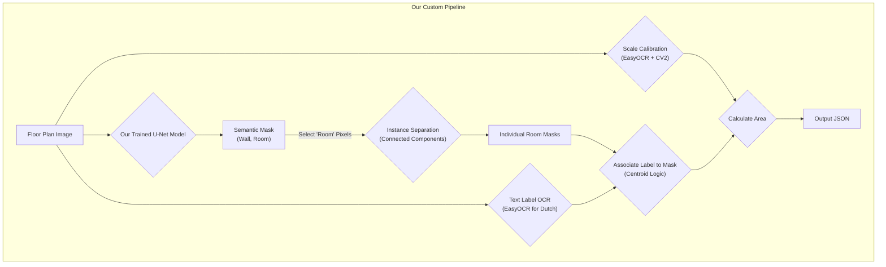

# Floor Plan AI Project Progress

## Project Overview
This project aims to build a custom AI pipeline to extract room areas and labels from floor plan images. The final goal is to process Dutch real estate listings from `funda.nl`. The core of the project involves training a custom semantic segmentation model (U-Net) and combining it with Optical Character Recognition (OCR) for a complete, end-to-end solution. This approach was chosen to provide full control over the pipeline and to build a strong portfolio piece demonstrating deep learning skills.

## Final Pipeline

## Phase 1: Environment & Data Preparation
- [] Set up Python 3.8+ environment with CUDA GPU support.
- [] Install initial dependencies: `torch`, `torchvision`, `opencv-python-headless`, `easyocr`, `segmentation-models-pytorch`.
- [] Verify CubiCasa5K dataset structure and analyze annotation format.
- [ ] Implement PyTorch `Dataset` and `DataLoader` for the CubiCasa5K dataset.
- [ ] The `Dataset` will load an image and create a simple semantic mask with 3 classes: 1 for walls, 2 for rooms, and 0 for background.
- [ ] Implement data augmentation pipeline (random flips, rotations, brightness/contrast jitter).

## Phase 2: Model Training
- [ ] Configure a U-Net model with a ResNet34 encoder using the `segmentation-models-pytorch` library.
- [ ] Set loss function (e.g., Dice Loss or a combination of Dice and Cross-Entropy).
- [ ] Set hyperparameters: Learning Rate (e.g., 0.001), Batch Size (e.g., 4), Epochs (e.g., 30).
- [ ] Implement a training loop in PyTorch, including a validation step to monitor performance on the validation set.
- [ ] Track IoU (Intersection over Union) or Dice score for room and wall classes.
- [ ] Implement model checkpointing to save the best-performing model weights.

## Phase 3: Inference and Post-Processing Pipeline
- [ ] Build the inference script that takes a new floor plan image.
- [ ] Load the trained U-Net model and perform segmentation to get the `(wall, room)` mask.
- [ ] Isolate the room mask and apply `cv2.connectedComponents` to get individual room instances.
- [ ] **Scale Calibration:**
    - Use EasyOCR to find text labels on the image.
    - Use regex to find a dimension label (e.g., "5.2m").
    - Find the associated line with OpenCV and measure its pixel length to get a `meters/pixel` ratio.
- [ ] **Label Association:**
    - For each room instance mask, calculate its centroid.
    - Find the OCR'd text box that contains the centroid.
    - Assign that text as the room's label (e.g., "Woonkamer").
- [ ] **Area Calculation:**
    - For each instance mask, count its pixels.
    - Calculate the final area: `area_m2 = pixel_count * (scale_factor**2)`.
- [ ] Generate the final JSON output.

## Phase 4: Evaluation & Adaptation for Dutch Floor Plans
- [ ] Evaluate the full pipeline's accuracy on the CubiCasa5K test set.
- [ ] Collect a test set of at least 50 floor plans from `funda.nl`.
- [ ] Manually annotate these plans to create a ground truth for evaluation.
- [ ] Test the pipeline on the Dutch plans, specificsally checking the OCR performance on Dutch text and the model's generalization.
- [ ] If needed, fine-tune the model on a small, annotated set of Dutch floor plans to improve performance.

## Current Status: Phase 1
Final plan confirmed. Ready to begin implementing the PyTorch Dataset and DataLoader.
